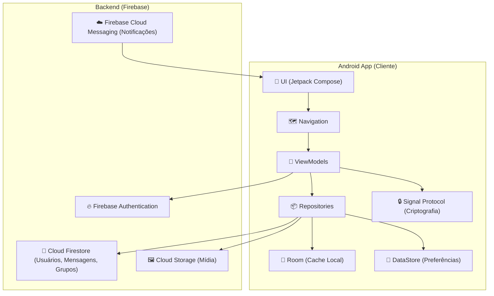

<div align="center">

 </div>
 
 
# Trabalho da Disciplina Programação para Dispositivos Móveis
 
Esse é o repositório para o trabalho da disciplina Programação para Dispositivos Móveis do curso de Sistemas de Informação da Universidade Federal de Uberlândia. 
###### Por Danilo Plissken, Luiz Fellipe Silva Lima, Eduardo Antonio da Silva, Ótavio Martins Gondim e Rogério Anastácio

<br>
<div align="center">
  
</div>


<br><br>

## 🧾 Índice 

* [ 📊 Diagrama de Arquitetura do Sistema](#-diagrama-de-arquitetura-do-sistema)
* [ 📖 Sobre o Aplicativo](#-sobre-o-aplicativo)
* [ ✅ Funcionalidades](#-funcionalidades)
* [ 🛠️ Tecnologias Utilizadas](#%EF%B8%8F-tecnologias-utilizadas)
* [ 🚀 Como Executar o Projeto](#-como-executar-o-projeto)
* [ 🔮 Melhorias Futuras](#-melhorias-futuras)

<br><br>


## 📊 Diagrama de Arquitetura do Sistema



<br>

[Retornar ao 🧾Índice](#-%C3%ADndice)

<br>

## 📖 Sobre o Aplicativo

**VCZapO** é um aplicativo de mensagens instantâneas para Android, desenvolvido em Kotlin com Jetpack Compose. O aplicativo oferece uma experiência de chat completa e segura, com conversas individuais e em grupo, tudo protegido com criptografia de ponta-a-ponta utilizando o Signal Protocol. A arquitetura de backend é baseada no Firebase, aproveitando o Cloud Firestore para dados em tempo real, Firebase Authentication para gerenciamento de usuários, e Cloud Storage para armazenamento de mídias.

Projetado para funcionar de forma eficiente online e offline, o VCZapO utiliza um banco de dados Room como cache local para mensagens e contatos, garantindo que o usuário tenha acesso às suas conversas mesmo sem conexão com a internet.

<br>

[Retornar ao 🧾Índice](#-%C3%ADndice)

<br>

## ✅ Funcionalidades

- ✅ **Autenticação Segura:** Múltiplas formas de login, incluindo E-mail/Senha, Google Sign-In e autenticação biométrica para acesso rápido e seguro.
- ✅ **Conversas em Tempo Real:** Chats individuais e em grupo com sincronização instantânea de mensagens.
- ✅ **Criptografia de Ponta-a-Ponta:** Todas as mensagens são protegidas com o Signal Protocol, garantindo a privacidade das conversas.
- ✅ **Suporte a Múltiplos Tipos de Mídia:** Envie mensagens de texto, imagens, vídeos, áudios, localização, stickers e outros tipos de arquivos.
- ✅ **Funcionalidades Avançadas de Mensagens:** Reaja a mensagens, edite o conteúdo enviado e veja indicadores de "digitando...".
- ✅ **Status de Presença:** Veja quando seus contatos estão online ou a última vez que estiveram ativos.
- ✅ **Notificações Push:** Receba notificações de novas mensagens em tempo real para não perder nada.
- ✅ **Modo Offline:** Acesse suas conversas e contatos mesmo sem conexão à internet, graças ao cache local com Room.
- ✅ **Busca de Usuários:** Encontre e inicie conversas com novos usuários facilmente.
- ✅ **Personalização:** Altere o tema do aplicativo (claro/escuro) e o tamanho da fonte para uma melhor experiência de visualização.
- ✅ **Perfil de Usuário:** Personalize seu perfil com foto e nome de usuário.

<br>

[Retornar ao 🧾Índice](#-%C3%ADndice)

<br>

## 🛠️ Tecnologias Utilizadas

-   **[Kotlin](https://kotlinlang.org/):** Linguagem de programação oficial para o desenvolvimento Android.
-   **[Jetpack Compose](https://developer.android.com/jetpack/compose):** Kit de ferramentas moderno para a criação de interfaces de usuário nativas do Android.
-   **[Firebase Authentication](https://firebase.google.com/docs/auth):** Para gerenciar a autenticação de usuários (E-mail/Senha, Google, Biometria).
-   **[Cloud Firestore](https://firebase.google.com/docs/firestore):** Banco de dados NoSQL para armazenar usuários, mensagens e grupos em tempo real.
-   **[Cloud Storage for Firebase](https://firebase.google.com/docs/storage):** Para armazenamento de arquivos de mídia como imagens, vídeos e áudios.
-   **[Firebase Cloud Messaging](https://firebase.google.com/docs/cloud-messaging):** Para o envio de notificações push.
-   **[Room](https://developer.android.com/training/data-storage/room):** Biblioteca de persistência para criar um cache offline do banco de dados.
-   **[DataStore](https://developer.android.com/topic/libraries/architecture/datastore?hl=pt-br):** Para armazenar preferências do usuário, como tema e tamanho da fonte.
-   **[Android Navigation](https://developer.android.com/guide/navigation):** Para lidar com a navegação entre as telas do aplicativo.
-   **[Coroutines & Flow](https://kotlinlang.org/docs/coroutines-overview.html):** Para gerenciar tarefas assíncronas e programação reativa.
-   **[Koin](https://insert-koin.io/):** Framework de injeção de dependência para Kotlin.
-   **[Signal Protocol](https://signal.org/docs/):** Para implementação da criptografia de ponta-a-ponta.
-   **[CameraX](https://developer.android.com/training/camerax):** Para funcionalidades de câmera dentro do aplicativo.
-   **[Coil](https://coil-kt.github.io/coil/):** Para carregamento de imagens.
-   **[Lottie](https://airbnb.io/lottie/):** Para animações.

<br>

[Retornar ao 🧾Índice](#-%C3%ADndice)

<br>

## 🚀 Como Executar o Projeto

Para compilar e executar este projeto localmente, siga os passos abaixo:

1.  **Clone o Repositório**
    ```bash
    git clone [https://github.com/master-rogerio/vczapo.git](https://github.com/master-rogerio/vczapo.git)
    
     ```

2.  **Configuração do Firebase**
    * Vá até o [console do Firebase](https://console.firebase.google.com/).
    * Crie um novo projeto.
    * Adicione um aplicativo Android ao seu projeto Firebase com o nome de pacote `com.pdm.vczap_o`.
    * Siga os passos para baixar o arquivo `google-services.json`.
    * Copie o arquivo `google-services.json` que você baixou e cole-o no diretório `app/` do projeto.
    * No console do Firebase, habilite os serviços de:
        * **Authentication** (com os provedores "E-mail/senha" e "Google").
        * **Cloud Firestore**.
        * **Cloud Storage**.
        * **Cloud Messaging**.

3.  **Abra no Android Studio**
    * Abra o projeto no Android Studio.
    * O Gradle irá sincronizar e baixar todas as dependências necessárias.
    * Execute o aplicativo em um emulador ou dispositivo físico.

<br>

[Retornar ao 🧾Índice](#-%C3%ADndice)

<br>

## 🔮 Melhorias Futuras
* Implementar chamadas de vídeo e de voz.
* Adicionar a funcionalidade de "Status" que desaparecem após 24 horas.
* Melhorar a interface com mais animações e transições.
* Adicionar a opção de backup de conversas no Google Drive.
* Permitir o envio de GIFs.

<br>

[Retornar ao 🧾Índice](#-%C3%ADndice)

<br>
